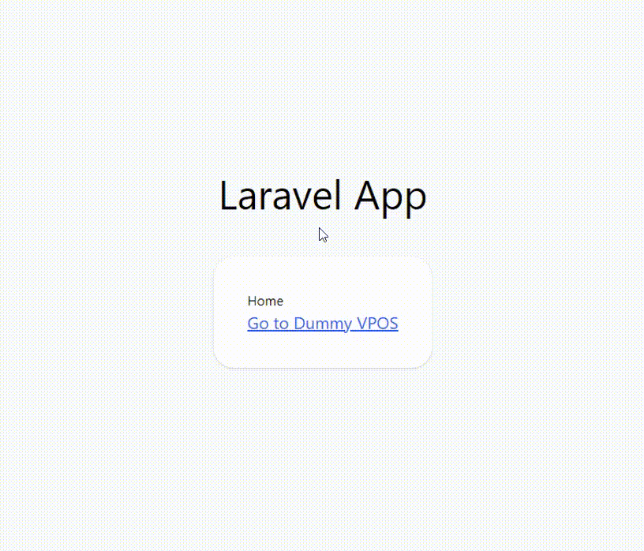

# dummy-vpos

[![Stable Version][badge_stable]][link_packagist]
[![Unstable Version][badge_unstable]][link_packagist]
[![Total Downloads][badge_downloads]][link_packagist]
[![License][badge_license]][link_license]

Dummy virtual POS integration for some weird testing cases.

For example some companies do not provide virtual pos in the test environment (there is only direct success or fail response). You can perform a virtual POS payment scenarios with fake integration.

**⚠️ Warning:** This package created only for synthetic testing purpose. Not included real payment methods and you must use only development environment.

## Table of contents

- [dummy-vpos](#dummy-vpos)
  - [Table of contents](#table-of-contents)
  - [Requirements](#requirements)
  - [Installation](#installation)
  - [Usage](#usage)
  - [Demo](#demo)

## Requirements

- PHP 7.3 or higher
- Laravel 7.0 or higher

## Installation

To get the latest version of `dummy-vpos`, simply require the project using [Composer](https://getcomposer.org):

```bash
$ composer require egoistdeveloper/dummy-vpos
```

Publish service provider:

```bash
$ php artisan vendor:publish --provider="DummyVpos\ServiceProvider"
```

## Usage

Grab your response parameters then build http query and redirect to `dummy-vpos.show` route.

```php
$params = [
    'test' => true,
    'id' => hash('md5', time()),
    'name' => 'John Doe',
    'price' => 999.99,
    'successCallback' => route('success'),
    'errorCallback' => route('fail'),
    ...
];

$vposUrl = route('dummy-vpos.show') . '?' . http_build_query($params);
```

**successCallback**, **errorCallback** and **price** are required for testing. Also price should be bigger than 0.

After reached fake virtual pos screen there are four possibility.

- Success
- Fail
  - Wrong password
  - Cancelation
  - Timeout

All cases returns back to callback url (with sended parameters except callback urls) and success and fail code/messages can found be in `dummy-vpos.php` config file.

## Demo
[Example Project](https://github.com/EgoistDeveloper/dummy-vpos-example)



[badge_downloads]:https://img.shields.io/packagist/dt/egoistdeveloper/dummy-vpos.svg?style=flat-square

[badge_license]:https://img.shields.io/packagist/l/egoistdeveloper/dummy-vpos.svg?style=flat-square

[badge_stable]:https://img.shields.io/github/v/release/egoistdeveloper/dummy-vpos?label=stable&style=flat-square

[badge_unstable]:https://img.shields.io/badge/unstable-dev--main-orange?style=flat-square

[link_license]:LICENSE

[link_packagist]:https://packagist.org/packages/egoistdeveloper/dummy-vpos
